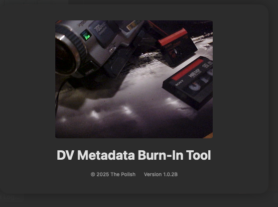
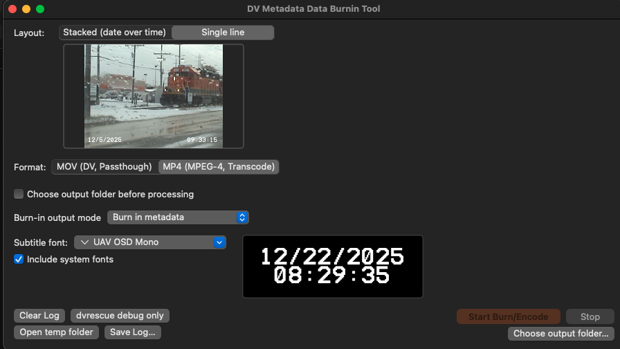
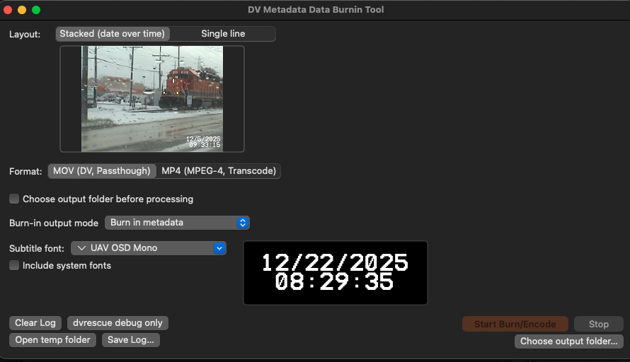
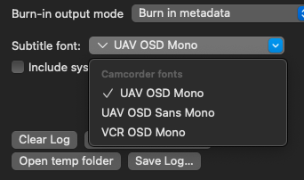
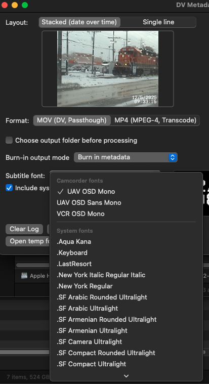

# DVMetaDataBurnIn

**DVMetaDataBurnIn** is a free, open source macOS utility for burning original DV/Digital8 camcorder date/time metadata directly into video files. It’s powered by `dvrescue` and `ffmpeg`, which prior to this involved me banging my head running terminal scripts to get the same result. I wanted a beter way for myself outside of apple script. This is my attempt to make DV timestamp burning actually useable for batchwork. 
---

## Known Issues

- File chooser doesn't limit to file types which the program will accept
- Unknown issue if this will this work on m series mac. Was built / works on an intel mac.
- Running a massive batch folder seems to overflow storage and cause other issues - most likely due to log handling - have to look into (ran 80 files) which resulted in the computer resetting at some point + breaking the RDT time burning in some videos (all conversions completed) with static time rather than rolling clock and an error saying low on space (that was not true after reset - thinking temp dir was full and caused a reboot)

---


## Features (work in progress but already functional)

- Batch or single-file AVI processing  
- Extracts original camcorder recording date/time from embedded DV metadata  
- Overlay date/time using what I feel are camcorder-style fonts   
- Export to MOV (original quality) or MP4 (H.264) but trying to keep it as close to "DV visual style" as possible (low compression) 
- No command-line required — simple macOS UI (thank god) 

---

## Features Roadmap (ideas)
- Additional layouts for how the camcorder fonts are burned in
    - Maybe a gallery, maybe a preview function idk
- Visual guide improvement (overlay with font instead of static image with prerendered default font)
- Hide debug in a tab or slider of sorts
- Improve debug logs
- Add clear temp directory button under debug 
- Fix temp file handling / clearing
- Organize UI better
- Custom FFMPEG args
- Better file browsing handling 
- Progress bar
- Auto chose batch or single file based on input field (.avi = single file, open folder = batch process)

---
## Screenshots
### Splash Screen


### Main Window


### Main Window (Alternate View)


### Camcorder Only Overview


### Font Picker



---

## Usage

1. **Download** the app (no releases yet — still iterating).  
2. **Launch** it.  
2a. Tell apple you don't care about security becuase you got this from the internet.'
3. **Select** a file or an entire folder of DV/Digital8 clips.  
4. Pick your **layout** and **output format**.  
5. Hit **Run Burn-In** and let it cook.

---

## Requirements

Nothing external.  
`ffmpeg` and `dvrescue` are bundled in the app bundle according to their respective licenses.  
Full license texts are in:  
`Resources/licenses/`

---

## Building (if you want to build it yourself)

1. Clone the repo:
    ```bash
    git clone https://github.com/shardsofaperture/DVMetaDataBurnIn.git
    ```
2. Open `DVMetaDataBurnIn.xcodeproj` in Xcode.  
3. Build & run.

Bundled tools:
- FFmpeg (LGPL/GPL)  
- dvrescue (BSD-3-Clause)

---

## Credits

- App & UI: Zach Zarzycki (powered by a suspicious amount of late-night vibe-coding)  

- **UAV OSD Font** by Nicholas Kruse  
  - Free for personal and commercial use  
  - https://www.dafont.com/uav-osd.font  
  - https://nicholaskruse.com/work/uavosd  

- **VCR OSD Mono** by Riciery Leal (mrmanet)  
  - Free for personal and commercial use per author comments  
  - https://www.dafont.com/font-comment.php?file=vcr_osd_mono  

- **FFmpeg** — https://ffmpeg.org/  
- **dvrescue** — https://mediaarea.net/DVRescue  

---

## License

MIT License (see [LICENSE](LICENSE))
